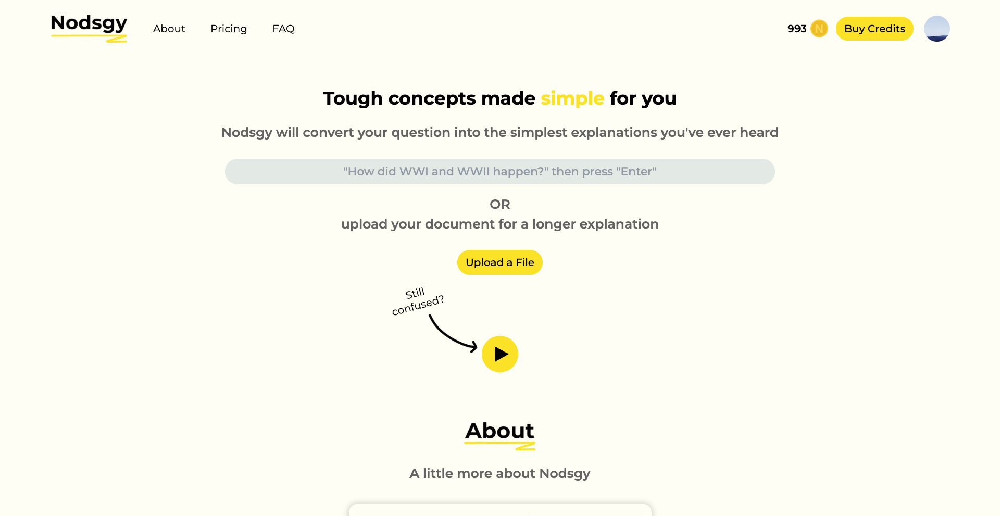

# Nodsgy Audio

An AI-powered text-to-audio learning platform that transforms documents and questions into comprehensive audio explanations with AI-generated summaries.



## About

Nodsgy Audio helps users learn through audio by converting educational content into spoken explanations. The platform uses OpenAI's API to:

- **Convert documents to audio**: Upload PDFs, PowerPoint presentations (PPTX), spreadsheets (XLSX), or OpenDocument files (ODT, ODP, ODS) and receive AI-generated audio explanations broken down into digestible sections
- **Answer questions with audio**: Type any question and get an instant audio explanation
- **Provide summary points**: Each audio segment includes key takeaways for quick reference
- **Offer playback controls**: Adjust playback speed (0.5x-2x), seek through audio, and download for offline listening

### Features

- **Multi-format document support** - PDF, PPTX, XLSX, ODT, ODP, ODS
- **AI-generated audio explanations** - Powered by OpenAI
- **Real-time streaming** - Audio generation with progress tracking
- **Smart chunking** - Long documents broken into focused sections
- **Persistent playback** - Continue where you left off with localStorage
- **User authentication** - Firebase-based auth system
- **Credit system** - Pay-as-you-go pricing (1 credit for questions, 3 for documents)
- **Stripe integration** - Secure payment processing

### Tech Stack

- **Frontend**: Next.js 14, React 18, TailwindCSS
- **Backend**: Next.js API Routes
- **AI**: OpenAI API
- **Database**: Firebase Firestore
- **Authentication**: Firebase Auth
- **Payments**: Stripe
- **Document Parsing**: pdf-parse, officeparser, pdfjs-dist

## Getting Started

### Installation

First, install the dependencies:

```bash
npm install
# or
yarn install
# or
pnpm install
```

### Running the Development Server

Then, run the development server:

```bash
npm run dev
# or
yarn dev
# or
pnpm dev
# or
bun dev
```

Open [http://localhost:3000](http://localhost:3000) with your browser to see the result.

You can start editing the page by modifying `app/page.js`. The page auto-updates as you edit the file.

This project uses [`next/font`](https://nextjs.org/docs/basic-features/font-optimization) to automatically optimize and load Inter, a custom Google Font.

## Environment Variables

You'll need to set up the following environment variables:

- Firebase configuration (API keys, project ID, etc.)
- OpenAI API key
- Stripe API keys (public and secret)

Create a `.env.local` file in the root directory with your credentials.

## How It Works

1. **Upload or Ask**: Users can either upload a document or type a question
2. **Processing**: The system extracts text from documents or processes the question
3. **AI Generation**: OpenAI generates structured audio content with titles and key points
4. **Streaming**: Audio files are created and streamed to the user in real-time
5. **Playback**: Users can listen, adjust speed, and download the audio files

## Project Structure

- `/src/app/api` - API routes for audio generation, payments, and webhooks
- `/src/app/components` - React components (AudioComponent, LandingPage, etc.)
- `/src/app/firebase` - Firebase configuration and admin setup
